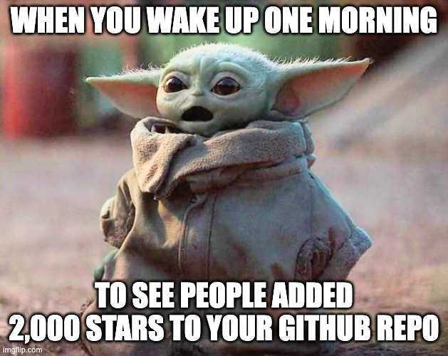

# GitHub

NOT PORTED YET

<!-- INDEX_START -->

- [GitHub SSH Key SSO Authorization](#github-ssh-key-sso-authorization)
- [Pull Requests](#pull-requests)
- [CodeOwners](#codeowners)
  - [CodeOwners Gotcha - Secret Teams](#codeowners-gotcha---secret-teams)
- [GitHub Profile Page](#github-profile-page)
- [Use Permalink URL References for Documentation or Support Issues](#use-permalink-url-references-for-documentation-or-support-issues)
- [Memes](#memes)
  - [O'Reilly - Choosing Based on GitHub Stars](#oreilly---choosing-based-on-github-stars)
  - [Baby Yoda Gets GitHub Stars](#baby-yoda-gets-github-stars)

<!-- INDEX_END -->

## GitHub SSH Key SSO Authorization

If you're using SSH keys to `git clone` in a company using GitHub SSO authentication then you will need
to authorize your SSH keys for each organization in order to be able to use them.

On this page listing your SSH keys:

<https://github.com/settings/keys>

On the right of each key, click the `Configure SSO` drop-down and then next to the organizations you're a member of
click `Authorize`.

<https://docs.github.com/en/enterprise-cloud@latest/authentication/authenticating-with-saml-single-sign-on/authorizing-an-ssh-key-for-use-with-saml-single-sign-on>

## Pull Requests

Use Pull Requests to track changes and get peer review and approval.

Keep PRs as small and atomic as possible -
people's eyes will glaze over on big PRs resulting in approve it, allowing bad code or bugs into the repo and defeating
the quality control of peer review.

## CodeOwners

[HariSekhon/Templates - .github/CODEOWNERS](https://github.com/HariSekhon/Templates/blob/master/.github/CODEOWNERS)

Enforce Pull Request reviews to all or given paths in the repo to this list of users or teams.

Auto-notifies these code owners requesting reviews when pull requests changing their files are raised.

### CodeOwners Gotcha - Secret Teams

When listing GitHub teams in the `.github/CODEOWNERS` file, the team must not be set to Secret otherwise it won't be
respected, on top of it requiring Write access to the repo.

## GitHub Profile Page

Create a GitHub repo with the same name as your GitHub profile username and in it create a `README.md` file
which will be automatically displayed as your GitHub profile home page.

You can do anything you normally can in Markdown - links, formatting, using HTML and embedding 3rd party tools like:

| URL                                                  | Description                                                                                                                                                |
|------------------------------------------------------|------------------------------------------------------------------------------------------------------------------------------------------------------------|
| <https://shields.io>                                 | Badges                                                                                                                                                     |
| <https://komarev.com/ghpvc/>                         | Profile hits counter                                                                                                                                       |
| <https://github.com/anuraghazra/github-readme-stats> | Profile Stats or GitHub repos to list more repos than that annoying [arbitrary 6 repo pin limitation](https://github.com/orgs/community/discussions/28350) |

See my GitHub Home Profile page:

<https://github.com/HariSekhon>

which comes from this repo:

<https://github.com/HariSekhon/HariSekhon>

GitLab uses this too but it puts a `Read more` link instead of displaying the whole page like GitHub.

## Use Permalink URL References for Documentation or Support Issues

When referencing GitHub lines or HTML anchors in [Documentation](documentation.md) or support issues,
use a permalink URL instead of the default branch link, which can change and misdirect your line number or anchor
references.

A permalink uses the commit hashref so that it always goes to that fixed line or anchor in history.

Press `y` on a page while browsing `GitHub.com` to change the current branch URL to a permalink hashref commit URL.

## Memes

### O'Reilly - Choosing Based on GitHub Stars

### Baby Yoda Gets GitHub Stars

